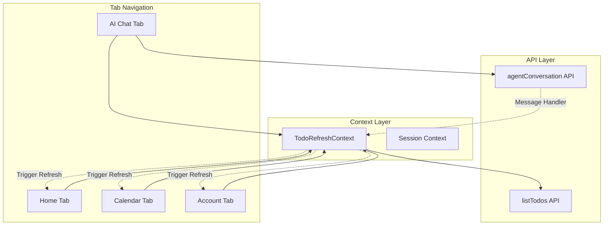
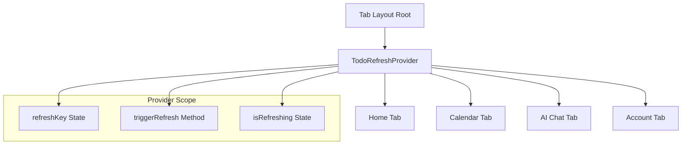
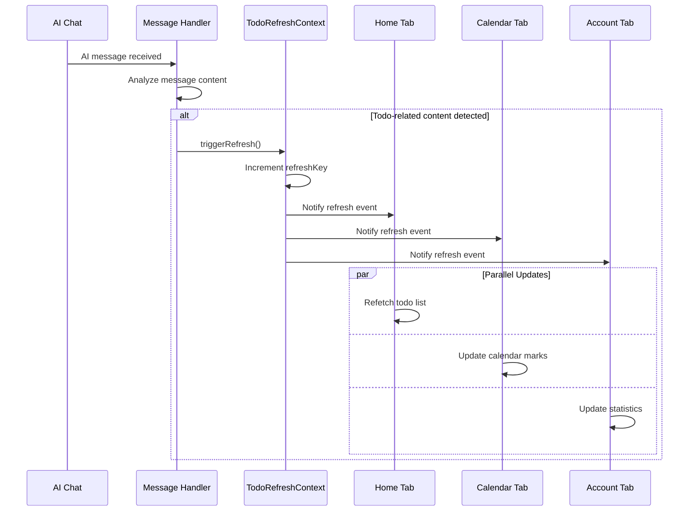
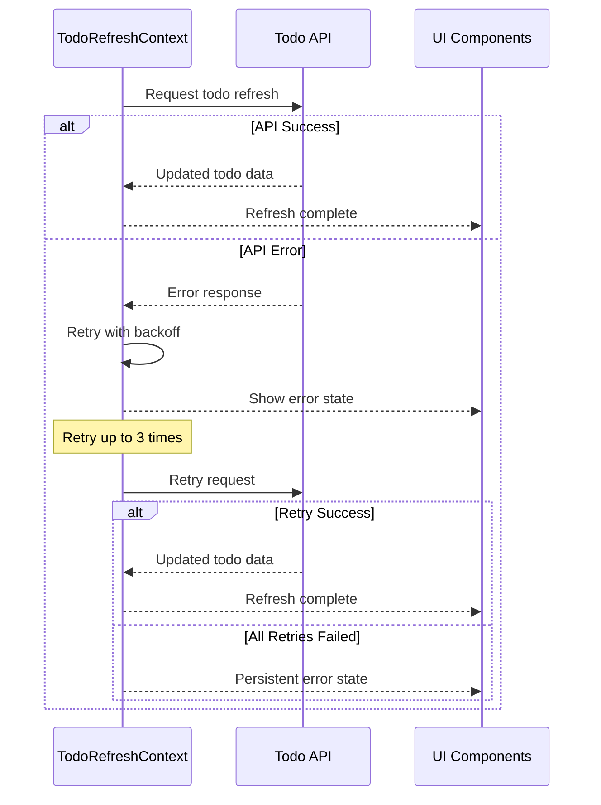

# Message Handler for Todos

## Overview

This design document outlines a cross-component communication system that allows the AI Chat component to trigger todo list refreshes across different tabs when receiving conversation messages. The system implements an event-driven architecture using React Context to enable real-time todo synchronization without tight coupling between components.

## Architecture

### System Components



### Component Interaction Flow

The message handler system operates through the following interaction pattern:

1. **AI Chat Message Reception**: When the AI chat receives a conversation message, it triggers a todo refresh event
2. **Context Propagation**: The refresh event is propagated through a shared React Context
3. **Component Subscription**: All todo-consuming components subscribe to refresh events
4. **Automatic Updates**: Todo lists across tabs automatically update when refresh events are triggered

## Core Components

### TodoRefreshContext

A React Context that manages todo refresh state and provides methods for triggering refreshes across the application.

```typescript
interface TodoRefreshContextType {
  refreshKey: number;
  triggerRefresh: () => void;
  isRefreshing: boolean;
}
```

**Key Responsibilities:**
- Maintain a global refresh counter
- Provide trigger mechanism for refresh events
- Track refresh state across components
- Ensure thread-safe refresh operations

### Message Handler

A utility module that detects when todo-related content is mentioned in AI conversations and automatically triggers todo list refreshes.

**Features:**
- **Content Analysis**: Analyzes AI responses for todo-related keywords
- **Smart Triggering**: Only triggers refreshes when relevant content is detected
- **Debouncing**: Prevents excessive refresh calls within short time windows
- **Error Handling**: Gracefully handles failed refresh attempts

### Component Integration Points

#### AI Chat Component
- **Message Reception Handler**: Intercepts AI conversation responses
- **Content Analysis**: Analyzes message content for todo-related triggers
- **Refresh Triggering**: Calls context refresh method when applicable

#### Home Tab Component
- **Refresh Subscription**: Listens to context refresh events
- **Todo List Updates**: Automatically refetches todo data on refresh events
- **Loading State Management**: Shows appropriate loading indicators during refreshes

#### Calendar Component
- **Date-based Refresh**: Updates todo markers and daily todo lists
- **Calendar Synchronization**: Ensures calendar marks reflect current todo state
- **Performance Optimization**: Only updates visible date ranges

#### Account Component
- **Statistics Updates**: Refreshes todo count statistics
- **Profile Synchronization**: Updates user profile with latest todo metrics

## Implementation Strategy

### Context Provider Setup

The TodoRefreshContext should be placed at the tab navigation level to ensure all tab components have access to refresh functionality:



### Message Detection Logic

The message handler implements intelligent content analysis to determine when todo refreshes are necessary:

**Trigger Conditions:**
- AI mentions creating, updating, or managing todos
- Conversation includes todo-related commands or suggestions
- AI provides todo organization or productivity advice
- Time-based or scheduling discussions occur

**Non-Trigger Conditions:**
- General conversation without todo references
- Error messages or system notifications
- Unrelated topic discussions

### Refresh Orchestration

The refresh system coordinates updates across multiple components using a centralized approach:

1. **Single Source of Truth**: Context maintains the authoritative refresh state
2. **Optimistic Updates**: UI components can show loading states immediately
3. **Error Recovery**: Failed refreshes are retried with exponential backoff
4. **Conflict Resolution**: Multiple simultaneous refresh requests are deduplicated

## Data Flow

### Normal Operation Flow



### Error Handling Flow



## Performance Considerations

### Refresh Optimization

- **Debouncing**: Multiple refresh requests within 500ms are consolidated
- **Selective Updates**: Only components in active tabs perform expensive operations
- **Caching**: Recent todo data is cached to reduce API calls
- **Background Updates**: Non-critical updates occur in background threads

### Memory Management

- **Event Cleanup**: Subscription cleanup on component unmount
- **Context Optimization**: Minimal context state to prevent unnecessary re-renders
- **Weak References**: Use weak references for component subscriptions where appropriate

### Network Efficiency

- **Request Deduplication**: Identical API requests are merged
- **Incremental Updates**: Only fetch changed data when possible
- **Connection Pooling**: Reuse HTTP connections for multiple requests

## Error Handling

### Failure Scenarios

1. **Network Connectivity Issues**
   - Graceful degradation with cached data
   - Retry mechanism with exponential backoff
   - User notification of connectivity problems

2. **API Rate Limiting**
   - Intelligent request throttling
   - Queue management for pending requests
   - Priority-based request scheduling

3. **Component Unmounting During Refresh**
   - Cleanup of pending requests
   - Prevention of state updates on unmounted components
   - Memory leak prevention

### Recovery Strategies

- **Automatic Retry**: Failed requests are automatically retried up to 3 times
- **Manual Refresh**: Users can manually trigger refreshes via pull-to-refresh
- **Offline Support**: Basic functionality available when network is unavailable
- **Error Reporting**: Non-critical errors are logged for debugging

## Testing Strategy

### Unit Testing

- **Context Provider**: Test refresh state management and event propagation
- **Message Handler**: Test content analysis and trigger logic
- **Component Integration**: Test subscription and refresh behavior

### Integration Testing

- **Cross-Tab Communication**: Verify refresh events propagate correctly
- **API Integration**: Test error handling and retry mechanisms
- **Performance Testing**: Measure refresh latency and resource usage

### User Acceptance Testing

- **Workflow Testing**: Verify end-to-end todo refresh scenarios
- **Edge Case Testing**: Test behavior under network issues and high load
- **Usability Testing**: Ensure refresh behavior feels natural to users